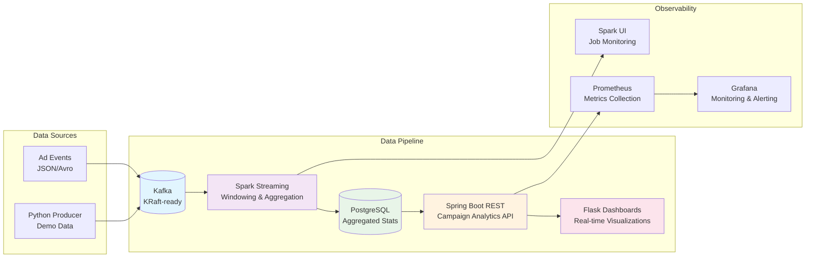

# TabulaRasa BI Core **v0.3**
*Enterprise AdTech Analytics Platform - Technical Excellence Showcase*  

<p align="center">
  
  
  
  
  
  
  
  
</p>

> **TabulaRasa BI Core** is an enterprise-grade, low-latency data engineering platform demonstrating modern AdTech analytics patterns. Built as a comprehensive technical assessment, it showcases real-time streaming, advanced SQL analytics, performance optimization, and scalable API design—all integrated into a unified, observable system.

---

## Project Overview & Value Proposition

This repository serves multiple stakeholder needs across the organization:

* **Business Leadership** — Real-time business KPIs with sub-5-second latency
* **Data Engineering Teams** — Production-ready Spark Structured Streaming with exactly-once semantics
* **Backend Engineering Teams** — Instrumented Spring Boot APIs with comprehensive observability
* **DevOps/SRE Teams** — Complete containerized stack with monitoring and alerting
* **Technical Assessment** — Structured evaluation of engineering practices across 4 core domains

### Technical Assessment Structure

The project addresses four key data engineering challenges:

| Component | Focus Area | Implementation |
|-----------|------------|----------------|
| **[Q1: Real-time Stream Processing](root/q1_realtime_stream_processing/)** | Spark Structured Streaming | Kafka → Spark → PostgreSQL pipeline with windowing & watermarks |
| **[Q2: Advanced SQL Analytics](root/q2_sql_ad_performance/)** | Query Optimization | Complex CTEs with window functions for campaign performance analysis |
| **[Q3: Java Performance Optimization](root/q3_java_refactoring/)** | Code Quality & Efficiency | Algorithmic improvements and modern Java best practices |
| **[Q4: API Design & Integration](root/q4_api_design_client/)** | REST API Design | Robust event ingestion with idempotency and error handling |

---

## System Architecture

### High-Level Data Flow
```
Raw Events → Kafka → Spark Streaming → PostgreSQL → REST API → Dashboards
     ↓             ↓                                      ↓         ↓
  Validation   Aggregation                              Metrics  Grafana
```

### Core Architecture Diagram
The diagram below provides a simplified view. For the complete architecture with infrastructure details, see **[docs/mermaid_graph.md](docs/mermaid_graph.md)**.



### Key Technical Features

- **Exactly-Once Processing**: Spark Structured Streaming with idempotent upserts
- **Low-Latency Windowing**: 1-minute tumbling windows with 10-second watermarks
- **Real-time Aggregation**: Campaign performance metrics with sub-5-second latency
- **Advanced Analytics**: Complex SQL with CTEs, window functions, and ranking
- **Multi-Dimensional Dashboards**: 4 specialized analytics views (Campaign, Publisher, Executive, Pipeline Health)
- **Production Observability**: Prometheus metrics, Grafana dashboards, health endpoints
- **Container-Native**: Full Docker Compose stack with dev and production profiles

---

## Quick Start

### Prerequisites
- **Java 17+** (OpenJDK recommended)
- **Maven 3.8+** 
- **Docker & Docker Compose** (24.0+)
- **Python 3.10+** (for dashboards and data generation)

### Option 1: Full Production Stack
```bash
# 1. Build all components (skip tests for speed)
mvn clean package -DskipTests

# 2. Launch complete infrastructure
docker compose -f root/docker/docker-compose.yml up -d

# 3. Start the application with Spark cluster integration
./run.sh prod spark
```

### Option 2: Local Development (Lightweight)
```bash
# 1. Launch minimal infrastructure (PostgreSQL + Kafka only)
docker compose -f root/docker/docker-compose.yml up -d tabularasa_postgres_db kafka

# 2. Run with embedded Spark (local mode)
./run.sh prod simple
```

### Service Access Points
| Service | URL | Description |
|---------|-----|-------------|
| **Analytics Dashboards** | http://localhost:8080 | Flask-based real-time analytics |
| **REST API** | http://localhost:8083 | Spring Boot campaign analytics API |
| **API Documentation** | http://localhost:8083/swagger-ui.html | Interactive Swagger UI |
| **Kafka UI** | http://localhost:8088 | Kafka cluster management interface |
| **Grafana Monitoring** | http://localhost:3000 | System metrics & alerts |
| **Prometheus** | http://localhost:9090 | Raw metrics endpoint |
| **Alertmanager** | http://localhost:9093 | Alert management interface |
| **Jaeger Tracing** | http://localhost:16686 | Distributed tracing interface |
| **Spark UI** | http://localhost:4040 | Job monitoring (when active) |

### Stop Services
```bash
./run.sh down  # Stops all services and cleans up volumes
```

---

## Technology Stack

| Layer | Technology | Version | Configuration |
|-------|------------|---------|---------------|
| **Event Streaming** | Apache Kafka | 3.7 | KRaft mode, dev-friendly setup, single-partition topics |
| **Stream Processing** | Apache Spark | 3.5.1 | Structured Streaming, foreachBatch sinks, Scala 2.12 |
| **Database** | PostgreSQL | 14 | Composite primary keys, UPSERT operations, connection pooling |
| **Application Framework** | Spring Boot | 3.4.7 | WebMVC, Actuator, Micrometer integration |
| **Dashboard Backend** | Flask | 2.3+ | SQLAlchemy ORM, Plotly visualizations, async PostgreSQL |
| **Build System** | Maven | 3.8+ | Multi-module project, dependency management, test profiles |
| **Containerization** | Docker Compose | 24.0+ | Multi-stage builds, health checks, resource limits |
| **Monitoring** | Prometheus + Grafana | Latest | Custom dashboards, JVM metrics, business KPIs |
| **Testing** | JUnit 5 + QuickTheories | Latest | Unit, integration, and property-based testing |

---

## Analytics Dashboard Suite

The platform includes four specialized analytics dashboards:

### 1. [Advertiser Campaign Performance](dashboards/advertiser_campaign_performance/)
- Campaign CTR trends and conversion funnels
- Bid optimization and spend analysis
- Real-time performance alerts

### 2. [Publisher Health & Yield Optimization](dashboards/publisher_health_yield_optimization/)
- Revenue per thousand impressions (RPM)
- Fill rate and latency analysis
- Publisher ranking and benchmarking

### 3. [CEO Executive Pulse](dashboards/ceo_executive_pulse/)
- High-level business KPIs
- Revenue trends and growth metrics
- Executive summary views

### 4. [BI Pipeline Health & Data Trust](dashboards/bi_pipeline_health_data_trust/)
- Data freshness and quality metrics
- Pipeline SLA monitoring
- Error rates and data lineage

Each dashboard supports:
- **Real-time updates** via WebSocket connections
- **Responsive design** with mobile-first approach
- **Dark/light mode** toggle for user preference
- **Export capabilities** for reports and presentations

---

## Testing & Quality Assurance

### Test Coverage Strategy
```bash
# Run all tests (unit + integration)
mvn test

# Run end-to-end pipeline test
./run.sh test

# Run with coverage reporting
mvn test jacoco:report
```

### Testing Methodology
- **Unit Tests**: Core business logic with 90%+ coverage
- **Integration Tests**: Database and Kafka interactions
- **Property-Based Tests**: Spark transformations with QuickTheories
- **End-to-End Tests**: Full pipeline validation with synthetic data
- **Performance Tests**: Load testing with configurable event volumes

### Quality Gates
- All tests must pass before deployment
- Code coverage minimum 85%
- No critical SonarQube violations
- Docker health checks must succeed
- API contract validation with OpenAPI

---

## Performance & Scalability

### Current Benchmarks
- **Event Throughput**: 10K+ events/second (single node)
- **End-to-End Latency**: <5 seconds (95th percentile)
- **Query Response Time**: <100ms (campaign analytics API)
- **Dashboard Load Time**: <2 seconds (real-time charts)

### Scalability Design
- **Horizontal Scaling**: Multi-worker Spark cluster support
- **Kafka Partitioning**: Ready for topic scaling and load distribution
- **Database Sharding**: Prepared table schemas for horizontal partitioning
- **Caching Layer**: Redis integration points for frequently accessed data

### Monitoring & Alerting
```bash
# Check system health
./run.sh status

# View real-time metrics
curl http://localhost:8083/actuator/metrics
```

---

## Configuration & Deployment

### Environment Profiles
- **`simple`**: Local development with embedded Spark
- **`spark`**: Production-like with Spark cluster
- **`test`**: Automated testing environment

### Key Configuration Files
```
├── root/docker/
│   ├── docker-compose.yml          # Production stack
│   ├── docker-compose.test.yml     # Testing environment
│   └── spark_submit.sh             # Spark job submission
├── root/q1_realtime_stream_processing/
│   ├── src/main/resources/
│   │   ├── application.yml         # Spring Boot configuration
│   │   ├── application-simple.yml  # Local development
│   │   └── application-spark.yml   # Cluster configuration
│   └── ddl/postgres_*.sql          # Database schemas
└── dashboards/
    ├── server.py                   # Flask dashboard server
    └── setup_tables.py            # Database initialization
```

---

## Documentation & Resources

### Technical Documentation
- **[Complete Architecture Diagram](docs/mermaid_graph.md)** - Detailed system design with infrastructure
- **[Original Assignment Specification](docs/ASSIGNMENT.md)** - Technical requirements and constraints
- **[Implementation Details](docs/solution_details.md)** - Solution approach for each component

### API Documentation
- **OpenAPI Specification**: Available at `/swagger-ui.html` when running
- **Postman Collection**: `root/q4_api_design_client/api-tests.postman_collection.json`

### Development Guides
```bash
# View all available commands
./run.sh help

# Check pipeline status
./run.sh status

# Start development dashboard server
./run.sh dash
```

---

## Release Notes - v0.3

### New Features
- **Enhanced Analytics Suite**: Four specialized dashboard categories with real-time updates
- **Production-Grade Observability**: Comprehensive Prometheus + Grafana monitoring stack
- **Advanced SQL Analytics**: Complex campaign performance queries with ranking and CTEs
- **Improved Error Handling**: Robust exception management with detailed logging
- **Container Optimization**: Multi-stage Docker builds with health checks

### Core Stabilization
- **Exactly-Once Semantics**: Verified Spark Structured Streaming with idempotent operations
- **KRaft-Ready Kafka**: Modern broker configuration without Zookeeper dependency
- **Auto-Scaling Ready**: Horizontal scaling support for Spark workers and Kafka partitions
- **Comprehensive Testing**: Unit, integration, property-based, and end-to-end test coverage

### Known Limitations
- **Single-Node Deployment**: Optimized for demonstration; easily scalable with configuration changes
- **Demo Data Volume**: Limited to sample datasets; production would require distributed storage
- **Basic Authentication**: Simple auth implementation; production would need OAuth2/JWT integration

---

## Future Roadmap

### Phase 1: Advanced Analytics (Q2 2025)
- **Machine Learning Integration**: Anomaly detection and forecasting models
- **Real-time Recommendations**: Campaign optimization suggestions
- **Advanced Visualizations**: Interactive 3D charts and geographic mapping

### Phase 2: Enterprise Features (Q3 2025)
- **Multi-Tenant Architecture**: Role-based access control and data isolation
- **API Gateway Integration**: Rate limiting, authentication, and request routing
- **Cost Optimization**: Columnar storage backends (Parquet, Delta Lake)

### Phase 3: Cloud-Native Evolution (Q4 2025)
- **Kubernetes Deployment**: Helm charts and operator patterns
- **Event-Driven Architecture**: Event sourcing and CQRS patterns
- **Serverless Functions**: AWS Lambda/Azure Functions for processing spikes

---

## Contributing

We welcome contributions! This project demonstrates enterprise-ready patterns that can be adapted for various use cases.

### Development Workflow
1. **Fork & Branch**: Create feature branches from `main`
2. **Code Standards**: Follow Conventional Commits and Google Java Style
3. **Testing**: Ensure all tests pass and coverage stays above 85%
4. **Documentation**: Update relevant docs for any API or architecture changes

### Pre-commit Requirements
```bash
# Install pre-commit hooks
pre-commit install

# Run all quality checks
pre-commit run --all-files
```

### Issue Reporting
- **Bug Reports**: Use the bug report template with reproduction steps
- **Feature Requests**: Describe the business case and technical approach
- **Questions**: Check existing documentation before opening discussions

---

## License & Attribution

**Creative Commons Attribution-NonCommercial 4.0 International** — see [`LICENSE`](LICENSE)

This project showcases modern data engineering practices and is intended for educational and assessment purposes.

---

<div align="center">

**Built by Alex Chernysh** · [`alex@hireex.ai`](mailto:alex@hireex.ai)

*Demonstrating Enterprise Data Engineering Excellence*

</div>
