<div align="center">
  
  
  
  
  
  
  
</div>

# TabulaRasa BI Core

TabulaRasa BI Core showcases production-grade data-platform patterns for large-scale AdTech workloads. It demonstrates high-throughput stream processing, advanced analytics, resilient API design and clean, testable Java code.

---

## Key Modules & Features

| Module | Description | Status |
|--------|-------------|--------|
| Q1: Real-time Event Stream Processing | Scalable Spark Structured Streaming pipeline (plus lightweight Java processor) with windowing, watermarking, exactly-once upserts and a pluggable sink layer (PostgreSQL by default). | ✅ Core Complete |
| Q2: Advanced SQL for Ad Performance | A Top-N campaign performance query by CTR per country, demonstrating advanced SQL functions. | ✅ Complete |
| Q3: Java Code Refactoring | A refactored `DataProcessor.java` to improve performance, maintainability, and adhere to best practices. | ✅ Complete |
| Q4: Data Ingestion API & Client | A REST API for event ingestion, including a sample Java client. | ✅ Complete |

- **Solution details:** [`docs/solution_details.md`](docs/solution_details.md)
- **Original assignment:** [`docs/ASSIGNMENT.md`](docs/ASSIGNMENT.md)

---

## Architecture

The following diagram illustrates the data pipeline architecture. The canonical source is located in `docs/mermaid_graph.md`.

```mermaid
flowchart LR
    %% Main styling for professional appearance
    classDef dataSourceStyle fill:#e6f2ff,stroke:#007bff,stroke-width:2px,color:#000
    classDef processStyle fill:#e6ffe6,stroke:#28a745,stroke-width:2px,color:#000
    classDef storageStyle fill:#e6e6ff,stroke:#6610f2,stroke-width:2px,color:#000
    classDef serviceStyle fill:#f0f0f0,stroke:#6c757d,stroke-width:2px,color:#000
    classDef userStyle fill:#fff0e6,stroke:#fd7e14,stroke-width:2px,color:#000
    classDef monitoringStyle fill:#ffffe6,stroke:#ffc107,stroke-width:2px,color:#000
    classDef securityStyle fill:#ffe6e6,stroke:#dc3545,stroke-width:2px,color:#000
    
    %% --- PIPELINE FLOW ---
    subgraph "Data Pipeline Architecture"
        direction LR
        
        %% STAGE 1: Data Ingestion & Streaming
        subgraph Stage1["Stage 1: Data Ingestion & Streaming"]
            direction TB
            DataSource["Data Source:\nSample File"]:::dataSourceStyle
            DataValidation["Data Validation"]:::processStyle
            
            subgraph "Mode 1: Spark Streaming"
                direction TB
                SparkJob["Spark Streaming Job"]:::processStyle
                DataSource --> DataValidation
                DataValidation --> SparkJob
            end
            
            subgraph "Mode 2: Simple Processor"
                direction LR
                KafkaProd["Kafka Producer"]:::processStyle
                KafkaTopic["Kafka Topic"]:::dataSourceStyle
                SimpleProc["Simple Event Processor"]:::processStyle
                
                DataSource --> DataValidation
                DataValidation --> KafkaProd
                KafkaProd -- "Ad Events" --> KafkaTopic
                KafkaTopic -- "Ad Events" --> SimpleProc
            end
        end
        
        %% STAGE 2: Real-time Processing & Aggregation
        subgraph Stage2["Stage 2: Real-time Processing & Aggregation"]
            direction TB
            %% Spark path
            SparkAgg["Spark: Windowing &\nAggregation"]:::processStyle
            SparkSink["Spark: PostgreSQL Sink"]:::processStyle
            
            %% Simple path
            SimpleAgg["Simple: Event Aggregation"]:::processStyle
            SimpleSink["Simple: PostgreSQL Sink"]:::processStyle
            
            %% Error handling
            ErrorHandler["Error Handler"]:::processStyle
            
            %% Connections
            SparkJob -- "Raw Events" --> SparkAgg
            SparkAgg -- "Aggregated Stats" --> SparkSink
            
            SimpleProc -- "Raw Events" --> SimpleAgg
            SimpleAgg -- "Aggregated Stats" --> SimpleSink
            
            SparkAgg -- "Errors" --> ErrorHandler
            SimpleAgg -- "Errors" --> ErrorHandler
        end
        
        %% STAGE 3: Data Storage & Exposure
        subgraph Stage3["Stage 3: Data Storage & Exposure"]
            direction TB
            CampaignDB[(Campaign Statistics\nDatabase)]:::storageStyle
            MetadataDB[(Metadata & Version\nManagement)]:::storageStyle
            RestAPI["REST API"]:::processStyle
            AuthService["Auth Service"]:::securityStyle
            UserClient(["User/Client"]):::userStyle
            
            SparkSink -- "Aggregated Stats" --> CampaignDB
            SimpleSink -- "Aggregated Stats" --> CampaignDB
            CampaignDB -- "Query Results" --> RestAPI
            MetadataDB -- "Metadata" --> RestAPI
            RestAPI -- "API Response" --> UserClient
            UserClient -- "API Request" --> AuthService
            AuthService -- "Authorized Request" --> RestAPI
        end
        
        %% Stage connections
        Stage1 --> Stage2
        Stage2 --> Stage3
    end
    
    subgraph "Supporting Infrastructure"
        direction TB
        %% Kafka Ecosystem
        Zookeeper["Zookeeper"]:::serviceStyle
        Kafka["Apache Kafka"]:::serviceStyle
        KafkaUI["Kafka UI"]:::serviceStyle
        
        %% Spark Ecosystem
        SparkMaster["Apache Spark Master"]:::serviceStyle
        SparkWorker["Apache Spark Worker"]:::serviceStyle
        
        %% Database
        PostgreSQL[(PostgreSQL Service)]:::serviceStyle
        
        %% Airflow
        AirflowInit["Airflow Init"]:::serviceStyle
        AirflowSched["Airflow Scheduler"]:::serviceStyle
        AirflowWeb["Airflow Webserver"]:::serviceStyle
        
        %% Monitoring
        Prometheus["Prometheus"]:::monitoringStyle
        Grafana["Grafana"]:::monitoringStyle
        
        %% Infrastructure connections
        Zookeeper --> Kafka
        Kafka --> KafkaUI
        SparkMaster --> SparkWorker
        
        AirflowInit --> PostgreSQL
        AirflowSched --> AirflowInit
        AirflowWeb --> AirflowInit
        
        Prometheus --> Grafana
    end
    
    %% Cross-subgraph connections
    SimpleProc -- "Metrics" --> Prometheus
    KafkaProd -- "Produces To" --> Kafka
    KafkaTopic -- "Managed By" --> Kafka
    
    SparkJob -- "Runs On" --> SparkMaster
    
    %% Database connections
    CampaignDB -- "Stored In" --> PostgreSQL
    MetadataDB -- "Stored In" --> PostgreSQL
```



---

## Core Technologies
- **Java:** 11+ (JDK 17 recommended)
- **Build:** Maven 3.6+
- **Data Processing:** Apache Spark 3.5
- **Messaging:** Apache Kafka 3.7
- **Database:** PostgreSQL 14.11
- **API:** Spring Boot 2.7
- **Containerization:** Docker & Docker Compose
- **Observability:** Prometheus, Grafana

---

## Getting Started

### Prerequisites
- Java 11+ (JDK 17 recommended)
- Maven 3.6+
- Docker Desktop (or Docker Engine with Docker Compose)

### 1. Build
From the project root, build the required Java artifacts:
```bash
mvn clean package -DskipTests
```

### 2. Run Services
Navigate to the Docker directory and start the services in detached mode:
```bash
cd root/docker
docker compose up -d
```
To stop all services and remove volumes, run `docker compose down -v`.

---

## Running Tests

### Unit & Integration Tests
Run the standard Maven test lifecycle from the project root:
```bash
mvn test
```

### End-to-End Pipeline Test
To run a complete test of the Spark Streaming pipeline, execute the dedicated test script. This automates the entire process in a clean, containerized environment.

1.  Make the script executable:
    ```bash
    chmod +x root/scripts/run_e2e_test.sh
    ```
2.  Run the script:
    ```bash
    ./root/scripts/run_e2e_test.sh
    ```
The script will build the JAR, start a test-specific Docker stack, produce data to Kafka, submit the Spark job, and tear down the environment automatically.

---

## Observability & Monitoring

The project includes a pre-configured monitoring stack.

| Component | URL | Description |
|-----------|-----|-------------|
| **Prometheus** | `http://localhost:9090` | Scrapes JVM and HTTP metrics from the Spring Boot application. |
| **Grafana** | `http://localhost:3000` | Visualizes metrics. A default dashboard is provisioned. Login: `admin`/`admin`. |
| **Alertmanager**| `http://localhost:9093` | Manages alerts defined in `docker/prometheus/alert.rules.yml`. |
| **Kafka UI** | `http://localhost:8088` | Provides a web interface for inspecting Kafka topics and messages. |
| **Jaeger** | Planned Feature | Distributed tracing is planned to track requests through the pipeline. |

---

## Planned Improvements (Roadmap)

- ✅ Core streaming, SQL analytics, API, monitoring
- Implement property-based test for Spark (`AdEventsSparkPropertyTest.java`).
- Resolve remaining Maven warnings (SLF4J, `maven-shade-plugin`).
- Polish documentation and validate all internal links.
- Integrate Jaeger for distributed tracing (API → Kafka → Spark pipeline).
- Add a CI/CD workflow (e.g., GitHub Actions) for automated builds and testing.
- (Optional) Implement a gRPC/protobuf-based API endpoint.
- (Optional) Provide a sample deployment configuration for a cloud platform (e.g., Render, Fly.io).

---

## License

This project is for demonstration purposes only.
