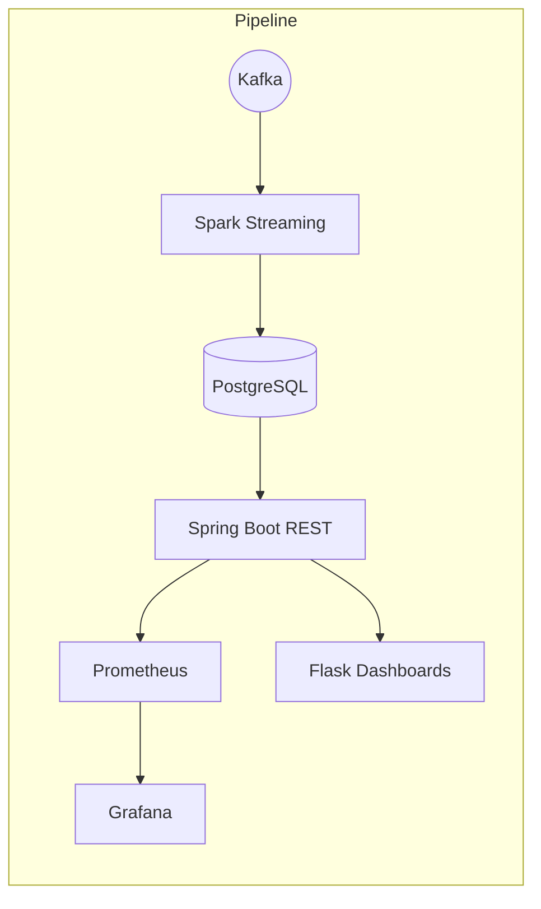

# TabulaRasa BI Core  
*Real-time AdTech analytics platform*  

<p align="center">
  
  
  
  
  
  
  
</p>

> **TabulaRasa BI Core** is a reference implementation of a production-ready, low-latency data pipeline for large-scale AdTech workloads. From event ingestion to interactive dashboards, the project showcases modern patterns you can copy-paste into your own stack.

---

## 🎯 Why This Repo?
* **Executives** — watch business KPIs update <5 s after an event happens.
* **Data Engineers** — study a clean Spark Structured Streaming → PostgreSQL upsert flow.
* **Backend Devs** — see a Spring-Boot REST API instrumented with Micrometer.
* **DevOps** — spin the whole thing up with one `docker compose up`.
* **Interviewers / HR** — evaluate engineering craft, tests, docs, CI.

---

## 🧩 Architecture
Kafka (ZooKeeper ➜ KRaft soon) → Spark Structured Streaming → PostgreSQL → Spring-Boot API → Prometheus/Grafana → Plotly Dashboards (Flask).

The following diagram illustrates the data pipeline architecture. The canonical source is located in `docs/mermaid_graph.md`.



---

## ⚡ Quick Start (Local)
```bash
# 1. clone + build jars (skip tests for speed)
mvn -q clean package -DskipTests

# 2. launch full stack
docker compose -f root/docker/docker-compose.test.yml up -d

# 3. follow the logs or open dashboards
./run.sh dash        # http://localhost:8080
open http://localhost:3000 # Grafana
```
To stop everything:
```bash
./run.sh down
```

---

## 🛠️  Tooling Highlights
| Layer | Tech | Notes |
|-------|------|-------|
| Ingestion | **Kafka 3.7** | ZK today, KRaft on roadmap |
| Streaming | **Spark 3.5** | Exactly-once upserts with foreachBatch |
| Storage | **PostgreSQL 14** | Composite PK, long-format stats |
| API | **Spring Boot 3.x** | Micrometer, Swagger UI, soon gRPC + GraphQL |
| Dashboards | **Plotly & Flask** | Instant shareable HTML, dark-mode UX |
| Observability | **Prometheus + Grafana** | RED, JVM & pipeline metrics |

---

## 🚀 4-Week Roadmap (condensed)
| Phase | Focus | ETA |
|-------|-------|-----|
| 0 | Foundation & Audit | +3 d |
| 1 | Data-Viz Perfection | +7 d |
| 2 | Kafka KRaft Migration | +11 d |
| 3 | gRPC / GraphQL APIs | +18 d |
| 4 | Performance & Cost | +24 d |
| 5 | Observability Deluxe | +26 d |
| 6 | CI/CD & Dev X | +27 d |
| 7 | Docs & Storytelling | +28 d |
| 8 | Packaging & Release | +28 d |


---

## 🧪 Testing
* **Unit & Integration:** `mvn test`
* **End-to-End:** `./run.sh test` spins a full stack, streams demo events, validates counts.
* **Property-Based:** Hypothesis tests for Spark transformations (see `debug/`).

---

## 🙌 Contributing
PRs welcomed! Please open an issue first if it's substantial. We follow **Conventional Commits** + automated release notes.

1. Fork → branch → PR.
2. `pre-commit run --all` must pass.
3. One feature or fix per PR.

---

## 🔐 License
Custom non-commercial license—see [`LICENSE`](LICENSE).

> © 2025 TabulaRasa.ai — built with ❤️ and caffeine.
