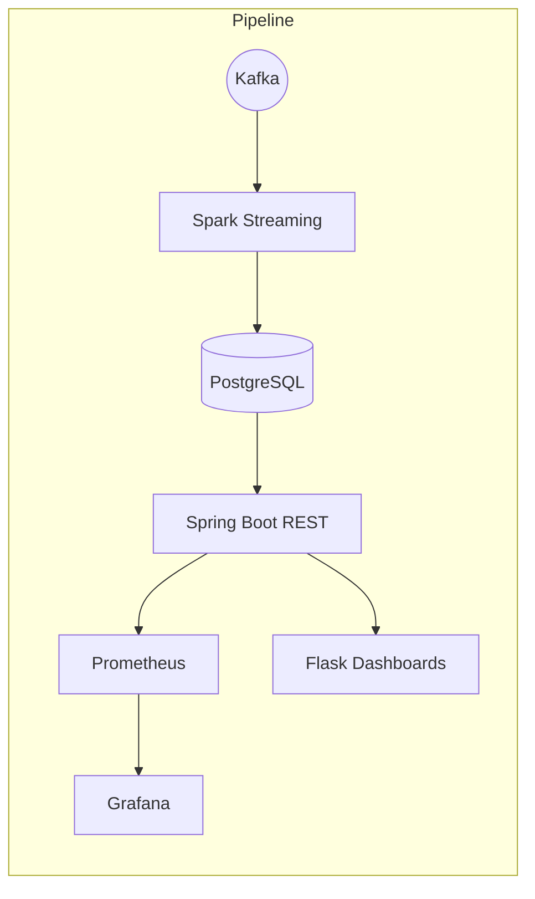

# TabulaRasa BI Core **rev. 0.3**
*Real-time AdTech analytics platform*  

<p align="center">
  
  
  
  
  
  
  
</p>

> **TabulaRasa BI Core** is a production-ready, low-latency data pipeline for large-scale AdTech workloads. From event ingestion to interactive dashboards, the project showcases modern patterns you can adapt for your own stack.

---

## 🎯 Why This Repo?
* **Executives** — watch business KPIs update <5s after an event happens.
* **Data Engineers** — study a clean Spark Structured Streaming → PostgreSQL upsert flow.
* **Backend Devs** — see a Spring Boot REST API instrumented with Micrometer.
* **DevOps** — spin the whole thing up with one `docker compose up`.
* **Interviewers / HR** — evaluate engineering craft, tests, docs, CI.

---

## 🧩 Architecture
Kafka (KRaft-ready) → Spark Structured Streaming → PostgreSQL → Spring Boot API → Prometheus/Grafana → Flask Dashboards.

The following diagram illustrates the data pipeline architecture. The canonical source is located in `docs/mermaid_graph.md`.



---

## ⚡ Quick Start (Local)
```bash
# 1. clone + build jars (skip tests for speed)
mvn -q clean package -DskipTests

# 2. launch full stack
docker compose -f root/docker/docker-compose.test.yml up -d

# 3. follow the logs or open dashboards
./run.sh dash        # http://localhost:8080
open http://localhost:3000 # Grafana
```
To stop everything:
```bash
./run.sh down
```

---

## 🛠️  Tooling Highlights
| Layer | Tech | Notes |
|-------|------|-------|
| Ingestion | **Kafka 3.7** | KRaft-ready, dev-mode enabled |
| Streaming | **Spark 3.5** | Exactly-once upserts with foreachBatch |
| Storage | **PostgreSQL 14** | Composite PK, aggregated stats table |
| API | **Spring Boot 3.4** | Micrometer, Swagger UI, health endpoints |
| Dashboards | **Flask + Plotly** | Real-time HTML dashboards, dark-mode UX |
| Observability | **Prometheus + Grafana** | RED, JVM & pipeline metrics |

---

## 🏗️ Project Structure
The codebase is organized around core data engineering challenges:

* **Q1 Real-time Stream Processing** — Spark Structured Streaming with Kafka
* **Q2 SQL Ad Performance** — Advanced analytics queries  
* **Q3 Java Refactoring** — Performance optimization patterns
* **Q4 API Design & Client** — REST endpoints with robust error handling
* **Dashboards** — Flask backend serving interactive Plotly visualizations
* **Docker Infrastructure** — Complete containerized stack with monitoring

---

## 🧪 Testing
* **Unit & Integration:** `mvn test` (from `root/` directory)
* **End-to-End:** `./run.sh test` spins a full stack, streams demo events, validates counts.
* **Property-Based:** QuickTheories tests for Spark transformations.

---

## 📊 **Release Notes - rev. 0.3**
✅ **Core Pipeline Stabilized** — Spark Structured Streaming with exactly-once semantics  
✅ **Flask Dashboard Backend** — Real-time metrics via PostgreSQL integration  
✅ **KRaft-Ready Kafka** — Modern broker configuration, dev-friendly setup  
✅ **Comprehensive Monitoring** — Prometheus + Grafana + Jaeger observability stack  
✅ **Unified Run Script** — Single entry point for all operations (`./run.sh`)  

⚠️ **Known Limitations**  
• Airflow integration commented out (ready for future orchestration needs)  
• Limited to single-node Spark cluster (easily scalable via docker-compose)  

---

## 🔮 Stay Tuned
Future enhancements on the radar:
* **Multi-tenant dashboards** with role-based access
* **gRPC + GraphQL APIs** for high-performance client integration  
* **Cost optimization** with columnar storage backends
* **Advanced ML features** for anomaly detection and forecasting

---

## 🙌 Contributing
PRs welcomed! Please open an issue first if it's substantial. We follow **Conventional Commits** + automated release notes.

1. Fork → branch → PR.
2. `pre-commit run --all` must pass.
3. One feature or fix per PR.

---

## 🔐 License
**Creative Commons Attribution-NonCommercial 4.0 International** — see [`LICENSE`](LICENSE).

> © 2025 Alex Chernysh <alex@hireex.ai> — built with ❤️ and caffeine.
