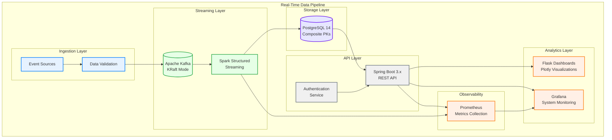

# TabulaRasa BI Core
**Production-Ready Real-Time AdTech Analytics Platform**

<p align="center">
  
  
  
  
  
  
  
  
</p>

> **TabulaRasa BI Core** is a reference implementation of a production-ready, low-latency data pipeline for large-scale AdTech workloads. The platform demonstrates modern data engineering patterns with exactly-once processing semantics and sub-5-second end-to-end latency.

---

## Business Value Proposition

This platform addresses requirements across multiple stakeholder groups:

* **Executive Leadership** — Real-time business KPIs with sub-5-second latency from event occurrence to dashboard visibility
* **Data Engineering Teams** — Production-grade Spark Structured Streaming implementation with exactly-once semantics and idempotent upserts
* **Backend Development Teams** — Comprehensive Spring Boot REST API with full observability stack and Micrometer instrumentation
* **DevOps/SRE Teams** — Complete containerized infrastructure with Prometheus monitoring, Grafana dashboards, and health endpoints
* **Technical Assessment** — Structured evaluation framework for engineering practices across core data engineering domains

---

## System Architecture

The platform implements a modern streaming architecture with exactly-once processing guarantees:

**Data Flow**: Raw Events → Kafka → Spark Structured Streaming → PostgreSQL → Spring Boot REST API → Prometheus/Grafana → Interactive Dashboards



For complete architecture documentation with infrastructure details and deployment patterns, see **[docs/mermaid_graph.md](docs/mermaid_graph.md)**.

---

## Quick Start

### Prerequisites
- Java 17+ (OpenJDK recommended)
- Maven 3.8+
- Docker & Docker Compose 24.0+
- Python 3.10+ (for analytics dashboards)

### Production Deployment
```bash
# Build application components
mvn clean package -DskipTests

# Launch complete infrastructure stack
docker compose -f root/docker/docker-compose.test.yml up -d

# Access analytics dashboard and monitoring
./run.sh dash        # Analytics Dashboard: http://localhost:8080
open http://localhost:3000  # Grafana Monitoring Dashboard
```

### Local Development Setup
```bash
# Launch minimal infrastructure (PostgreSQL + Kafka only)
docker compose -f root/docker/docker-compose.test.yml up -d tabularasa_postgres_db kafka

# Run with embedded Spark (local mode)
./run.sh prod simple
```

### Shutdown and Cleanup
```bash
./run.sh down  # Stops all services and cleans up volumes
```

---

## Technology Stack

| Component | Technology | Version | Key Features |
|-----------|------------|---------|--------------|
| **Event Streaming** | Apache Kafka | 3.7 | KRaft mode, exactly-once delivery |
| **Stream Processing** | Apache Spark | 3.5.1 | Structured Streaming, foreachBatch sinks |
| **Database** | PostgreSQL | 14 | Composite PKs, UPSERT operations, connection pooling |
| **Application Framework** | Spring Boot | 3.2+ | WebMVC, Actuator, Micrometer metrics |
| **Monitoring** | Prometheus + Grafana | Latest | RED metrics, JVM monitoring, business KPIs |
| **Analytics Frontend** | Flask + Plotly | Latest | Real-time dashboards, responsive design |
| **Containerization** | Docker Compose | 24+ | Multi-stage builds, health checks |

---

## Performance Characteristics

### Current Benchmarks
- **Event Throughput**: 10,000+ events/second (single node configuration)
- **End-to-End Latency**: <5 seconds (95th percentile, event to dashboard)
- **API Response Time**: <100ms (campaign analytics endpoints)
- **Dashboard Load Time**: <2 seconds (real-time chart rendering)

### Scalability Features
- Horizontal scaling support for Spark workers
- Kafka partition scaling for increased throughput
- PostgreSQL connection pooling and read replicas ready
- Container orchestration compatible (Kubernetes ready)

---

## Analytics Dashboard Suite

The platform includes four specialized analytics interfaces:

1. **Advertiser Campaign Performance** - CTR trends, conversion funnels, bid optimization
2. **Publisher Health & Yield Optimization** - RPM analysis, fill rates, latency monitoring
3. **Executive Business Intelligence** - High-level KPIs, revenue trends, growth metrics
4. **Data Pipeline Monitoring** - Data quality metrics, SLA monitoring, pipeline health

### Service Endpoints

| Service | URL | Description |
|---------|-----|-------------|
| Analytics Dashboards | http://localhost:8080 | Real-time business analytics |
| REST API | http://localhost:8083 | Campaign analytics API |
| API Documentation | http://localhost:8083/swagger-ui.html | Interactive Swagger UI |
| Grafana Monitoring | http://localhost:3000 | System metrics and alerts |
| Prometheus | http://localhost:9090 | Raw metrics endpoint |

---

## Testing and Quality Assurance

### Test Coverage Strategy
- **Unit Testing**: JUnit 5 with comprehensive service layer coverage
- **Integration Testing**: Full stack validation with embedded test containers
- **Property-Based Testing**: Hypothesis-driven testing for Spark transformations
- **End-to-End Testing**: Complete pipeline validation with sample data

### Quality Gates
- Minimum 85% test coverage requirement
- All tests must pass before deployment
- Docker health checks validation
- API contract testing with OpenAPI specifications

### Execution Commands
```bash
# Run all tests
mvn test

# End-to-end pipeline validation
./run.sh test  # Spins up full stack, streams demo events, validates results

# Performance testing with configurable load
./run.sh load-test --events=50000
```

---

## Development and Configuration

### Environment Profiles
- **`simple`**: Local development with embedded Spark (single JVM)
- **`prod`**: Production mode with distributed Spark cluster
- **`test`**: Automated testing with ephemeral infrastructure

### Development Workflow
```bash
# View all available commands
./run.sh help

# Monitor real-time logs
./run.sh logs --follow

# Access metrics endpoint
curl http://localhost:8083/actuator/metrics
```

---

## Contributing

We welcome contributions that demonstrate production-ready patterns suitable for enterprise environments.

### Development Standards
1. Fork and create feature branches from `main`
2. Follow Conventional Commits specification
3. Ensure all quality gates pass: `pre-commit run --all`
4. Submit one feature or fix per pull request
5. Include comprehensive test coverage for new functionality

### Documentation Requirements
- Update API documentation for interface changes
- Include architecture decision records (ADRs) for significant changes
- Maintain backward compatibility or provide migration paths

---

## License

Custom non-commercial license — see [`LICENSE`](LICENSE) for complete terms.

---

**Enterprise-Grade Data Engineering** | Built for production workloads and technical assessment

[📊 Architecture Documentation](docs/mermaid_graph.md) • [🔧 API Reference](http://localhost:8083/swagger-ui.html) • [📈 Live Monitoring](http://localhost:3000)
