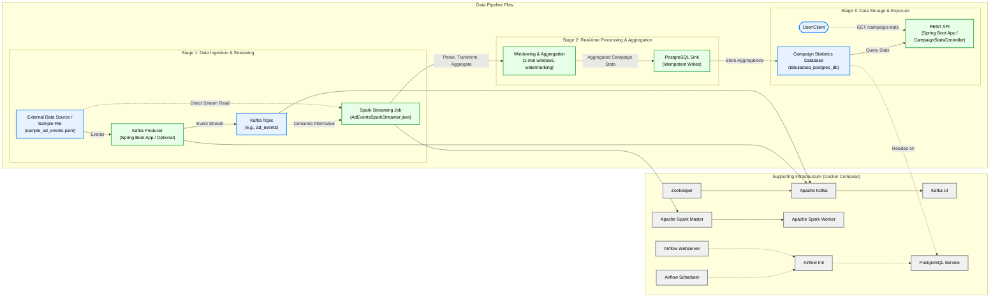

# TabulaRasa BI Core

<div align="center">
  
  
  
  
  
  
  
</div>

<div align="center">
  <h3>A Proof-of-Concept for Senior BI Data Engineer Challenges</h3>
  <p>TabulaRasa BI Core is a boilerplate solution addressing a hypothetical take-home assignment for a Senior BI Data Engineer position. Built "from a clean slate" (<i>tabula rasa</i>), it demonstrates core data engineering skills with a focus on real-time event stream processing, advanced SQL analytics, Java refactoring, and API design.</p>
</div>

---

## 📋 Overview

**TabulaRasa BI Core** is a modular proof-of-concept (PoC) designed to tackle complex data engineering challenges as outlined in a hypothetical assignment for a senior data engineering role. The project targets key areas such as real-time ad event processing with Apache Spark, SQL-based business intelligence queries, Java refactoring, and RESTful API design for data ingestion.

**Current Status**: This project is a **Work in Progress (WIP)** with a readiness of approximately **58%** based on the internal project plan. It serves as a foundational boilerplate, demonstrating core functionalities with room for further refinement and testing. The focus has been on establishing a robust architecture aligned with typical AdTech data challenges and technical stacks used in large-scale data environments.

**Purpose**: To illustrate a "glue engineer" mindset—bridging business intelligence needs with scalable technical solutions—while addressing specific requirements of a senior data engineering role, including proficiency in Java, Spark, and data pipeline design.

**Pipeline Flowchart**:

[View Detailed Pipeline Flowchart](docs/mermaid_graph.md)


```mermaid
flowchart LR

    subgraph "Supporting Infrastructure (Docker Compose)"
        direction TB

        ZK[Zookeeper]
        K[Apache Kafka]
        KUI[Kafka UI]
        SM[Apache Spark Master]
        SW[Apache Spark Worker]
        PG[PostgreSQL Service]

        %% Airflow (Conceptual)
        AFI[Airflow Init]
        AFS[Airflow Scheduler]
        AFW[Airflow Webserver]

        ZK --> K
        K --> KUI
        SM --> SW
        
        AFI -.-> PG
        AFS -.-> AFI
        AFW -.-> AFI
    end

    subgraph "Data Pipeline Flow"
        direction TB

        subgraph "Stage 1: Data Ingestion & Streaming"
            DS["External Data Source /\nSample File\n(sample_ad_events.jsonl)"]
            KP["Kafka Producer\n(Spring Boot App / Optional)"]
            KT["Kafka Topic\n(e.g., ad_events)"]
            SSJ["Spark Streaming Job\n(AdEventsSparkStreamer.java)"]

            DS -->|Events| KP
            KP -->|Event Stream| KT
            KT -.->|Consume Alternative| SSJ
            DS -.->|Direct Stream Read| SSJ
        end
        
        subgraph "Stage 2: Real-time Processing & Aggregation"
            WA["Windowing & Aggregation\n(1-min windows, watermarking)"]
            PS["PostgreSQL Sink\n(Idempotent Writes)"]
            
            SSJ -->|Parse, Transform, Aggregate| WA
            WA -->|Aggregated Campaign Stats| PS
        end

        subgraph "Stage 3: Data Storage & Exposure"
            DB["Campaign Statistics Database\n(tabularasa_postgres_db)"]
            API["REST API\n(Spring Boot App /\nCampaignStatsController)"]
            UI(["User/Client"])
            
            PS -->|Store Aggregations| DB
            DB -->|Query Stats| API
            UI -.->|GET /campaign-stats| API
        end
    end

    %% Connections from Pipeline elements to Infrastructure services
    KP --> K
    KT --> K
    SSJ --> SM
    DB -.->|Resides on| PG

    %% Styling - using original class definitions and assignments
    classDef dataStyle fill:#e6f2ff,stroke:#007bff,stroke-width:2px,color:#000
    classDef processStyle fill:#e6ffe6,stroke:#28a745,stroke-width:2px,color:#000
    classDef serviceStyle fill:#f0f0f0,stroke:#6c757d,stroke-width:2px,color:#000
    classDef userStyle fill:#fff0e6,stroke:#fd7e14,stroke-width:2px,color:#000

    class DS,KT,DB,UI dataStyle
    class KP,SSJ,WA,PS,API processStyle
    class ZK,K,KUI,SM,SW,PG,AFW,AFS,AFI serviceStyle
```
---

## 🌟 Key Features & Assignment Solutions

This PoC addresses four primary challenges from the hypothetical assignment:

| **Module**                          | **Description**                                                                 | **Status**       |
|-------------------------------------|--------------------------------------------------------------------------------|------------------|
| **Q1: Real-time Event Stream Processing** | Java/Spring Boot app for Kafka event production, Spark Structured Streaming for ad event aggregation with windowing and watermarking, PostgreSQL sink with idempotent writes, and a REST API for campaign stats. | ✅ Core Complete |
| **Q2: Advanced SQL for Ad Performance**   | SQL query to identify top-performing campaigns by CTR per country, using CTEs and window functions. | ✅ Complete      |
| **Q3: Java Code Refactoring**             | Refactored `DataProcessor.java` for performance, memory efficiency, and Java best practices, with unit tests. | ✅ Complete      |
| **Q4: Data Ingestion API Design & Client** | Conceptual REST API design for BI event ingestion and a Java client for payload construction and response handling. | ✅ Complete      |

**Note**: While core components are implemented, additional testing and documentation are planned (see [Project Status & Roadmap](#-project-status--roadmap)).

---

## 🛠️ Core Technologies

The project aligns with a technical stack commonly used in AdTech and data engineering environments:
- **Java 11+**: Primary language for development, using Spring Boot for Kafka integration and REST API.
- **Apache Spark 3.2+**: Structured Streaming for real-time event processing in Q1.
- **Spring Boot 2.7+**: Framework for Kafka producer and RESTful API in Q1.
- **PostgreSQL 13+**: Data sink for aggregated results (via Docker), chosen for robustness over HSQLDB with notes on scaling to columnar databases.
- **Apache Kafka 2.8+**: Event streaming backbone (via Docker) for Q1.
- **Docker & Docker Compose**: Containerized services for Kafka, Zookeeper, PostgreSQL, and Spark.
- **Maven**: Build and dependency management.
- **Apache Airflow**: Setup defined but currently disabled in `docker-compose.yml` due to initialization issues.

---

## 📂 Project Structure

The repository is organized as a multi-module Maven project for clarity and modularity:

```
├── root/
│   ├── docker/                          # Docker Compose for Kafka, PostgreSQL, Spark
│   ├── q1_realtime_stream_processing/   # Q1: Kafka producer, Spark streaming, DB sink, REST API
│   │   ├── src/main/java/...           # Java source code
│   │   ├── data/                       # Sample data (e.g., sample_ad_events.jsonl)
│   │   └── ddl/                        # Database schema definitions
│   ├── q2_sql_ad_performance/           # Q2: SQL query and explanation
│   ├── q3_java_refactoring/             # Q3: Refactored Java code and tests
│   ├── q4_api_design_client/            # Q4: API design doc and Java client
│   ├── scripts/                         # Utility scripts for running components
│   ├── pom.xml                          # Root Maven project file
│   └── README.md                        # This file
└── .gitignore                           # Git ignore rules
```

---

## 🚀 Quick Start

### Prerequisites
- **Java 11+** (or 17+ as specified in `q1_realtime_stream_processing/pom.xml`)
- **Maven 3.6+**
- **Docker Desktop** (or Docker Engine with Docker Compose)

### Build
```bash
# From the project root (tabularasa-bi-core/root)
mvn clean package
```
This builds all modules. The primary JAR for Q1 is located at `root/q1_realtime_stream_processing/target/q1_realtime_stream_processing-0.0.1-SNAPSHOT.jar`.

### Start Services
```bash
# Navigate to Docker directory
cd root/docker
docker-compose up -d
```
This starts Kafka, Zookeeper, PostgreSQL, and Spark services. Check status with:
```bash
docker-compose ps
```

### Run Q1 MVP (Real-time Stream Processing)
For a quick demo of the core pipeline (Kafka -> Spark -> PostgreSQL -> API):
```bash
# From project root (tabularasa-bi-core/root)
chmod +x scripts/run_q1_app.sh
./scripts/run_q1_app.sh
```
This script builds the project, creates the PostgreSQL schema, and runs the Spring Boot app (Kafka producer & REST API). Access the API at `http://localhost:8081/campaign-stats/{campaign_id}`.

**Note**: The Spark job submission requires additional steps (see [Detailed Run Instructions](#-detailed-run-instructions)).

### Stop Services
```bash
cd root/docker
docker-compose down
```

---

## 📘 Detailed Run Instructions

### Q1: Real-time Event Stream Processing
1. **Ensure Docker services are running** (Kafka, PostgreSQL, Spark Master/Worker).
2. **Run Spring Boot App (Kafka Producer & REST API)**:
   ```bash
   java -jar root/q1_realtime_stream_processing/target/q1_realtime_stream_processing-0.0.1-SNAPSHOT-spring-boot.jar --spring.config.location=file:q1_realtime_stream_processing/src/main/resources/application.properties
   ```
3. **Submit Spark Job (`AdEventsSparkStreamer`)**:
   - Copy JAR to Spark Master container:
     ```bash
     docker cp root/q1_realtime_stream_processing/target/q1_realtime_stream_processing-0.0.1-SNAPSHOT.jar tabularasa-bi-core-spark-master-1:/opt/bitnami/spark/app.jar
     ```
   - Execute `spark-submit`:
     ```bash
     docker exec tabularasa-bi-core-spark-master-1 spark-submit \
       --master spark://spark-master:7077 \
       --class com.tabularasa.bi.q1_realtime_stream_processing.spark.AdEventsSparkStreamer \
       --deploy-mode client \
       /opt/bitnami/spark/app.jar
     ```
   - Monitor via Spark UI (`http://localhost:8081`).
4. **Data Source**: Spark reads from a sample file (`sample_ad_events.jsonl`) to simulate ad events.

### Q2-Q4: Static Solutions
- **Q2 SQL Query**: Located at `root/q2_sql_ad_performance/ad_performance_top_campaigns.sql`.
- **Q3 Refactored Java**: See `root/q3_java_refactoring/DataProcessor.java`.
- **Q4 API Design & Client**: Review `root/q4_api_design_client/api_design.md` and `ApiClient.java`.

---

## 📊 Project Status & Roadmap

**Current Readiness**: Approximately 58/120 points (48.3%) based on a detailed internal checklist. Core functionalities for all assignment challenges are implemented, focusing on a robust architecture aligned with common AdTech data processing stacks (Java, Spark, Kafka).

**Detailed Checklist Summary**:
Below is a summarized checklist of completed and pending tasks to provide insight into the project's progress:

| **Task**                                   | **Sub-Task**                                      | **Points** | **Status** |
|--------------------------------------------|--------------------------------------------------|------------|------------|
| **Q1: Real-time Event Stream Processing**  | Producer (Java Kafka)                            | 5          | ✅         |
| **Q1: Real-time Event Stream Processing**  | Spark Job (windowing, watermarking, aggregation) | 10         | ✅         |
| **Q1: Real-time Event Stream Processing**  | DB Sink (PostgreSQL, idempotent writes)          | 7          | ✅         |
| **Q1: Real-time Event Stream Processing**  | REST API (Spring Boot)                           | 5          | ✅         |
| **Q1: Real-time Event Stream Processing**  | Unit/Integration Tests for Spark, DB Sink        | 10         | 📝 TODO    |
| **Q2: Advanced SQL for Ad Performance**    | SQL Query (window functions, CTEs)               | 5          | ✅         |
| **Q3: Java Code Refactoring**              | Refactor DataProcessor.java                      | 5          | ✅         |
| **Q4: Data Ingestion API Design & Client** | API Design Doc & Java Client                     | 6          | ✅         |
| **General Requirements**                   | Project Setup, Build/Run Instructions            | 8          | 📝 Partial |
| **Verification & Validation**              | End-to-End Test with Realistic Data              | 4          | 📝 TODO    |

**Total Points**: 120 | **Completed Points**: 58 | **Readiness**: 48.3%

**Why WIP?**: This project is a boilerplate/PoC intended to demonstrate an approach and technical capabilities for a senior data engineering role. While key components are functional, additional work on unit tests, end-to-end validation with high-volume data, and documentation polish is planned to reach full production readiness.

### Planned Next Steps
- **Unit/Integration Tests**: Add tests for Spark job and DB sink components.
- **End-to-End Testing**: Validate pipeline with simulated high-volume data.
- **Documentation**: Enhance README with detailed design rationale and diagrams.
- **Configuration**: Externalize all settings to configuration files.
- **Optional Deployment**: Explore hosting Q1 API on a cloud platform.

**Transparency**: The focus has been on establishing a strong foundation over full completion within the scope of this PoC. Discussions on finalizing these components or adapting them to specific needs are welcomed.

---

## 💡 Design Rationale & Assumptions

- **Focus on AdTech Stack**: Emphasis on Java, Spark, and Kafka to align with environments typical for AdTech data pipelines.
- **PostgreSQL over HSQLDB**: Chosen for Q1 data sink due to its robustness and similarity to production systems like columnar databases (noted in code comments for scalability).
- **Modularity**: Multi-module structure for clarity and future extensibility.
- **Production Patterns**: Idempotent writes in Spark sink, containerization with Docker, and REST API design reflect real-world practices.
- **Data Simulation**: Uses a schema inspired by the Criteo Sponsored Search Conversion Log Dataset for realistic ad event simulation in Q1. This publicly available dataset (https://ailab.criteo.com/criteo-sponsored-search-conversion-log-dataset/) is planned for validating the concept with real-world data patterns, ensuring the solution handles typical AdTech data challenges.
- **Hypothetical API**: For Q4, the data ingestion API is conceptual and hypothetical, as no access to real production APIs was available. The design and client implementation are based on assumptions of what such an API might entail, focusing on RESTful principles, idempotency, and error handling.

---

## 🔍 Why TabulaRasa BI Core?

This project reflects an approach to connecting business intelligence needs with scalable technical solutions. It showcases:
- **Technical Proficiency**: Hands-on implementation with Java, Spark, and Kafka.
- **Problem-Solving**: Addressing complex requirements like real-time processing and data idempotency.
- **Proactive Learning**: Rapid adaptation to a relevant technical stack, focusing on areas like Java and Spark streaming.
- **Business Alignment**: Emphasis on AdTech-relevant analytics (e.g., campaign performance metrics).

This PoC can be extended or tailored to specific BI challenges in data-intensive environments, with openness to further discussion on adaptation.

---

## 📜 Hypothetical Assignment Context

The structure and goals of this project are based on a hypothetical take-home assignment for a Senior BI Data Engineer role, focusing on skills relevant to large-scale data processing in AdTech. Below is a summarized context of the challenges addressed:

- **Q1: Real-time Event Stream Processing**: Develop a Java application using Apache Spark Structured Streaming to process a stream of ad campaign events. Tasks include generating or reading a stream, aggregating event counts and bid amounts in 1-minute tumbling windows with watermarking for late data, storing results in a database, and optionally exposing results via a REST API.
- **Q2: Advanced SQL for Ad Performance Analysis**: Write a SQL query to identify top-performing campaigns by Click-Through Rate (CTR) per country for a specific day, handling edge cases like zero impressions.
- **Q3: Java Code Refactoring & Optimization**: Refactor a provided Java class for correctness, efficiency, and adherence to best practices, with explanations of changes.
- **Q4: Data Ingestion API Design & Client**: Design a REST API endpoint for external systems to push event data, considering idempotency and validation, and implement a Java client to interact with this hypothetical API.

This context guides the project's design, ensuring alignment with typical expectations for senior data engineering assessments.

---

## 🤝 Contributing & Feedback

As a PoC for demonstrating technical capabilities, this project is primarily a standalone effort. However, feedback is welcome! Feel free to open an issue or reach out to discuss the approach or suggest improvements.

---

## 📜 License

This project is for demonstration purposes and not currently licensed for commercial use. For inquiries, please contact the repository owner.

---

<div align="center">
  <p><i>TabulaRasa BI Core: A clean-slate approach to building BI solutions for data engineering challenges.</i></p>
</div>
