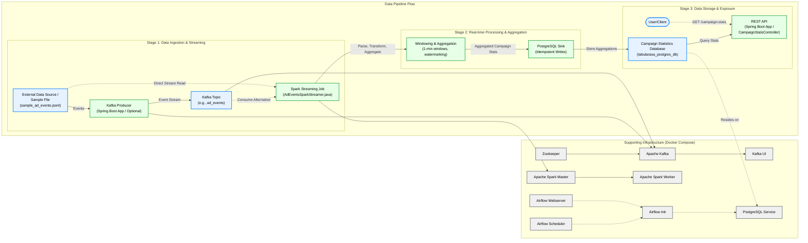

```mermaid
flowchart LR

    subgraph "Supporting Infrastructure (Docker Compose)"
        direction TB

        ZK[Zookeeper]
        K[Apache Kafka]
        KUI[Kafka UI]
        SM[Apache Spark Master]
        SW[Apache Spark Worker]
        PG[PostgreSQL Service]

        %% Airflow (Conceptual)
        AFI[Airflow Init]
        AFS[Airflow Scheduler]
        AFW[Airflow Webserver]

        ZK --> K
        K --> KUI
        SM --> SW
        
        AFI -.-> PG
        AFS -.-> AFI
        AFW -.-> AFI
    end

    subgraph "Data Pipeline Flow"
        direction TB

        subgraph "Stage 1: Data Ingestion & Streaming"
            DS["External Data Source /\nSample File\n(sample_ad_events.jsonl)"]
            KP["Kafka Producer\n(Spring Boot App / Optional)"]
            KT["Kafka Topic\n(e.g., ad_events)"]
            SSJ["Spark Streaming Job\n(AdEventsSparkStreamer.java)"]

            DS -->|Events| KP
            KP -->|Event Stream| KT
            KT -.->|Consume Alternative| SSJ
            DS -.->|Direct Stream Read| SSJ
        end
        
        subgraph "Stage 2: Real-time Processing & Aggregation"
            WA["Windowing & Aggregation\n(1-min windows, watermarking)"]
            PS["PostgreSQL Sink\n(Idempotent Writes)"]
            
            SSJ -->|Parse, Transform, Aggregate| WA
            WA -->|Aggregated Campaign Stats| PS
        end

        subgraph "Stage 3: Data Storage & Exposure"
            DB["Campaign Statistics Database\n(tabularasa_postgres_db)"]
            API["REST API\n(Spring Boot App /\nCampaignStatsController)"]
            UI(["User/Client"])
            
            PS -->|Store Aggregations| DB
            DB -->|Query Stats| API
            UI -.->|GET /campaign-stats| API
        end
    end

    %% Connections from Pipeline elements to Infrastructure services
    KP --> K
    KT --> K
    SSJ --> SM
    DB -.->|Resides on| PG

    %% Styling - using original class definitions and assignments
    classDef dataStyle fill:#e6f2ff,stroke:#007bff,stroke-width:2px,color:#000
    classDef processStyle fill:#e6ffe6,stroke:#28a745,stroke-width:2px,color:#000
    classDef serviceStyle fill:#f0f0f0,stroke:#6c757d,stroke-width:2px,color:#000
    classDef userStyle fill:#fff0e6,stroke:#fd7e14,stroke-width:2px,color:#000

    class DS,KT,DB,UI dataStyle
    class KP,SSJ,WA,PS,API processStyle
    class ZK,K,KUI,SM,SW,PG,AFW,AFS,AFI serviceStyle
```